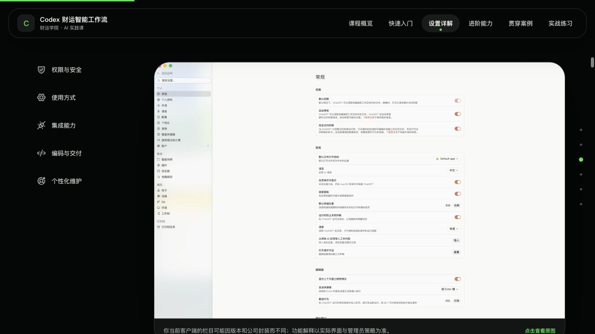
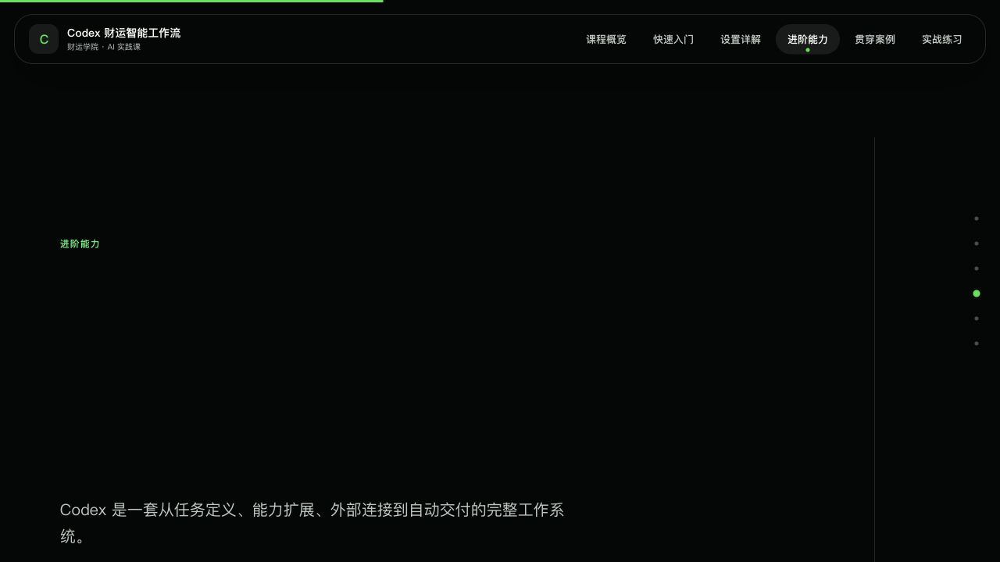
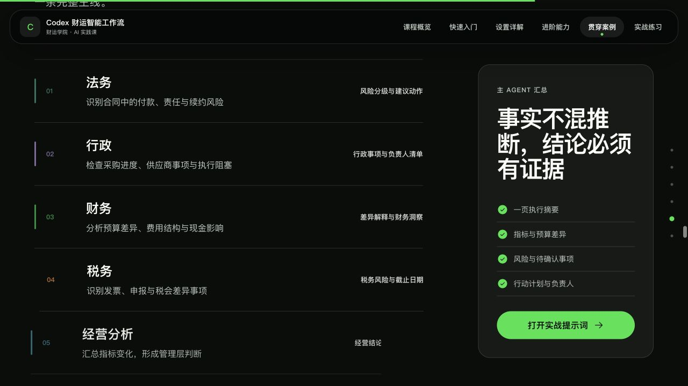
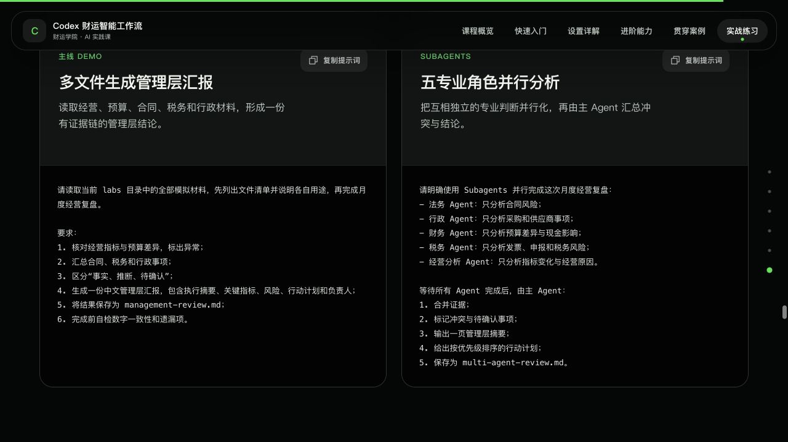
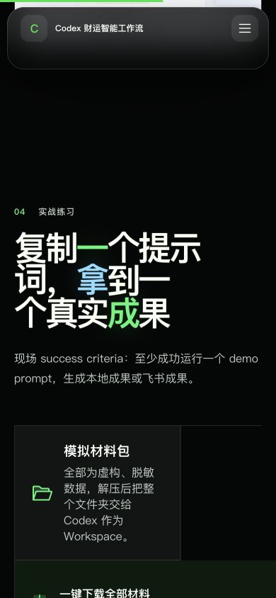

# Codex 财运智能工作流｜项目审计报告

审计日期：2026-07-27  
范围：课程文档、讲师 Runbook、Prompt Pack、自学材料、实验数据、React 网站、GSAP 动效、desktop/mobile 体验、accessibility 风险、GitHub Pages / Sites 构建。

## 总体结论

当前版本已经具备完整课程产品的骨架，可以用于 **desktop + 讲师带教的内部 pilot**。内容体系、安全边界、贯穿案例、实验数据和技术交付都明显高于一般培训页。

但它还不适合直接作为“学员独立浏览的跨设备正式版”冻结发布。发布前至少应处理：下载包飞书 Prompt 的人工确认 gate、第一项跟做 Prompt 漂移、移动端实验包布局、设置建议口径冲突、首页核心入口缺失、GSAP 章节跳转/深链异常。完成这些后，再做一次真实投影 + 390px mobile + reduced-motion 回归。

## 最值得保留的部分

1. **双层课程结构成立**：90 分钟现场主线与课后深度材料分开，方向正确。
2. **贯穿案例很强**：月度经营复盘把文件、Subagents、Skills、证据链、网页和飞书交付串成一个业务闭环。
3. **安全不是口号**：Workspace、密钥、第三方 Skill、外部写入、数字勾稽都被设计成明确 gate。
4. **新手教学结构完整**：主要章节基本具备“是什么 / 什么时候用 / 怎么做 / Demo / 边界 / 完成标准”。
5. **实验包可验证**：9 个文件与 zip 同步，经营利润、预算差异、行政采购、逾期应收等勾稽关系一致。
6. **技术交付健康**：production build 成功，Sites 4 项测试通过，本地资源与主要外链均可访问，浏览器 Console 无 error/warn。
7. **产品资料较新**：设置指南标注 2026-07-24 的验证日期，并对未被官方资料确认的入口保留边界；课程对 Skills、Plugins、MCP、Subagents、Automations、AGENTS.md 的定位与当前官方资料总体一致。

## 发布前优先级

### P0｜学员实际下载的飞书写入 Prompt 缺少人工确认 gate

- 正式 Prompt Pack 与网站教学明确要求“影响预览 → 人工确认 → 执行写入 → 写后读取”。
- 但 zip 内的 `prompts.md` Prompt 7 会直接创建飞书文档，Prompt 9 会直接新建 Base 并导入记录；两者都没有先展示目标对象并等待明确确认。
- Lab README 还明确引导已配置飞书的学员继续运行 Prompt 7–10。
- 影响：学员实际拿到手的练习文件违反全课最重要的 external-write safety rule，应作为发布 blocker。
- 证据：[public/labs/prompts.md](/Users/evan/Documents/Codex 培训材料/public/labs/prompts.md:118)、[public/labs/prompts.md](/Users/evan/Documents/Codex 培训材料/public/labs/prompts.md:147)、[content/prompt-pack.md](/Users/evan/Documents/Codex 培训材料/content/prompt-pack.md:415)、[content/prompt-pack.md](/Users/evan/Documents/Codex 培训材料/content/prompt-pack.md:469)。

### P0｜第一项新手跟做没有对应到网站的实际 Prompt

- Runbook 与完整版 Prompt Pack 要求第一项跟做只读 `01-operating-metrics.csv`，生成经营指标摘要并复核一个数字。
- 网站章节文案也说“所有学员复制经营指标摘要 Prompt”，但其 `promptId` 指向 `manager-report`；网站可见的第一张 Prompt 卡实际是多文件管理层汇报。
- 该 Prompt 又要求读取“当前 `labs` 目录”，而网站指导学员把解压后的 `codex-labs` 本身设为 Workspace；下载包内没有嵌套 `labs/`。
- 影响：本应在 10 分钟内建立信心的 first win 会变成找不到目录或启动重任务，直接伤害 Runbook 的 80% 完成率目标。
- 证据：[instructor-runbook.md](/Users/evan/Documents/Codex 培训材料/internal/instructor-runbook.md:135)、[prompt-pack.md](/Users/evan/Documents/Codex 培训材料/content/prompt-pack.md:36)、[chapterDetails.js](/Users/evan/Documents/Codex 培训材料/src/data/chapterDetails.js:150)、[chapterDetails.js](/Users/evan/Documents/Codex 培训材料/src/data/chapterDetails.js:623)、[prompts.js](/Users/evan/Documents/Codex 培训材料/src/data/prompts.js:3)。

### P0｜移动端实验包入口被裁切

- 390px 视口实测：`.lab-downloads` 宽 350px，但 `grid-template-columns` 形成 `234.594px 244.188px 291.891px` 三个隐式列；“一键下载全部材料”卡宽 771px。
- 原因是 desktop 的 `.lab-downloads__all { grid-column: span 3; }` 在 mobile breakpoint 未重置；只重置了 intro。
- 影响：移动端核心学习动作——下载实验包——无法完整呈现，后续单文件卡片也会受 grid 影响。
- 证据：[src/styles.css](/Users/evan/Documents/Codex 培训材料/src/styles.css:909)、[src/styles.css](/Users/evan/Documents/Codex 培训材料/src/styles.css:934)、[src/styles.css](/Users/evan/Documents/Codex 培训材料/src/styles.css:2288)。

### P1｜网站与详细指南给出相反的设置建议

- 网站建议现场使用“引导”，详细指南则建议小白、培训、高风险任务使用“排队”，并说明“引导”可能改变当前计划。
- 网站写“自动审核按公司策略”，详细指南明确现场培训关闭。
- 影响：新手可能在任务运行中改变当前 run，或对 approval 采取过宽配置；这属于教学与安全口径冲突。
- 证据：[settings.js](/Users/evan/Documents/Codex 培训材料/src/data/settings.js:16)、[settings.js](/Users/evan/Documents/Codex 培训材料/src/data/settings.js:39)、[codex-desktop-guide.md](/Users/evan/Documents/Codex 培训材料/content/codex-desktop-guide.md:17)、[codex-desktop-guide.md](/Users/evan/Documents/Codex 培训材料/content/codex-desktop-guide.md:145)。当前官方设置资料也把 running message 区分为 steer 与 queue：[Settings](https://learn.chatgpt.com/docs/reference/settings#general)。

### P1｜首页缺少课程定义要求的三个核心入口

- 课程大纲要求首页提供“开始课程 / 下载实验材料 / 复制第一个 Prompt”，学员动作还包括打开课前检查。
- 实际 Hero 只有“进入课程 / 滚动探索”；实验包、Prompt、课前检查均在很深的位置。
- 影响：讲师 Runbook 的前 5 分钟无法按站点直接带学员进入同一状态，迟到或自学用户也不知道第一步做什么。
- 证据：[course-outline.md](/Users/evan/Documents/Codex 培训材料/content/course-outline.md:26)、[App.jsx](/Users/evan/Documents/Codex 培训材料/src/App.jsx:130)。

### P1｜章节跳转与深链会被 GSAP pin 状态破坏

- 从导航直达“进阶能力”后，实测首屏出现大面积空白，主标题缺席；继续滚动后能力卡才出现。
- 直接打开 `/#closing` 时，URL hash 保留，但页面仍停在 Hero；实测 `scrollY = 0`，closing 在视口下方约 40,549px。
- 原因与 `scrollIntoView`、ScrollTrigger 初始化/刷新、水平 pinned section 的时序共同相关。
- 影响：导航会给人“页面没加载”的错觉；章节链接不能可靠分享。
- 证据：[App.jsx](/Users/evan/Documents/Codex 培训材料/src/App.jsx:100)、[animations.js](/Users/evan/Documents/Codex 培训材料/src/animations.js:745)。

### P1｜90 分钟 success criteria 的口径需要统一

- 课程大纲写“每位学员”完成完整闭环；讲师 Runbook 的 cohort KPI 是 80% 以上至少运行一个 Prompt，且只有完成者产出成果。
- 两种目标都合理，但一个是 individual learning objective，一个是 cohort delivery KPI，当前没有明确分层。
- 影响：课后复盘无法判断“课程成功”到底按个人闭环、完成率还是成果率衡量。
- 证据：[course-outline.md](/Users/evan/Documents/Codex 培训材料/content/course-outline.md:14)、[instructor-runbook.md](/Users/evan/Documents/Codex 培训材料/internal/instructor-runbook.md:9)。

### P1｜三套 Prompt 轨道已发生 source-of-truth 漂移

- 完整 Prompt Pack、网站 Prompt 卡、zip 内 `prompts.md` 的首个练习、输出目录、飞书安全 gate、Superpowers 调用方式都不一致。
- 下载包开头还要求使用不存在的 `monthly-review` 文件夹，实际 zip 解压目录是 `codex-labs`。
- 建议：建立 canonical Prompt data/schema，由同一来源生成网站卡片、完整版指南和 Lab 精简版；禁止三处手工维护。
- 证据：[prompt-pack.md](/Users/evan/Documents/Codex 培训材料/content/prompt-pack.md:36)、[prompts.js](/Users/evan/Documents/Codex 培训材料/src/data/prompts.js:3)、[public/labs/prompts.md](/Users/evan/Documents/Codex 培训材料/public/labs/prompts.md:3)。

### P1｜90 分钟课程更接近 capability showcase，而不是新手技能形成

- 真正的学员跟做只有一个 10 分钟模块，其中 4 分钟执行、2 分钟验收。
- 随后连续安排多文件复盘、Subagents、Skills/Superpowers、创建 Skill、Sites、飞书交付；在零基础、单讲师、无助教条件下，认知切换密度很高。
- 建议：现场核心保留 `Workspace → 单文件成果 → 复核 → 一个多文件/飞书 Demo`；Skill creation、Sites、Superpowers 三选一，其余明确标“课后扩展”。
- 证据：[instructor-runbook.md](/Users/evan/Documents/Codex 培训材料/internal/instructor-runbook.md:44)、[instructor-runbook.md](/Users/evan/Documents/Codex 培训材料/internal/instructor-runbook.md:135)。

### P1｜逐文件下载入口只覆盖 6/9 文件

- 网站只列 01–06，遗漏 `07-feishu-base.json`、`prompts.md`、`README.md`；但 Lab 练习顺序需要 Prompt 与 Base。
- zip 可以兜底，但“逐个下载”路径不完整。应补齐三项，或明确标注“仅核心输入文件”。
- 证据：[App.jsx](/Users/evan/Documents/Codex 培训材料/src/App.jsx:35)、[public/labs/README.md](/Users/evan/Documents/Codex 培训材料/public/labs/README.md:5)。

### P2｜主导航无法表达实际内容深度

- 顶部导航与进度 rail 只有 6 个章节，后续飞书、安全、学习路径、资料库、结课均不在导航和 active-section 逻辑中。
- 9 个进阶主题全部折叠在一个“进阶能力”入口里，novice 很难定位当前知识点或回到某个主题。
- 建议：保留 6 个一级入口，同时增加当前章节的二级目录、课程模式标记（现场主线 / 课后扩展）和可复制 deep link。
- 证据：[course.js](/Users/evan/Documents/Codex 培训材料/src/data/course.js:18)、[App.jsx](/Users/evan/Documents/Codex 培训材料/src/App.jsx:388)。

### P2｜移动导航 keyboard 行为不完整

- 实测菜单可以打开并正确切换 `aria-expanded`；但 `Escape` 不会关闭。
- 代码没有 Escape handler、焦点返回或 menu focus management；折叠菜单只使用 `max-height: 0` 与 `opacity: 0`，隐藏按钮仍可能进入 tab order。
- 建议：关闭态使用 `visibility` / `inert` 或条件渲染；支持 Escape；打开后将焦点移到首项，关闭后返回 toggle。
- 证据：[Header.jsx](/Users/evan/Documents/Codex 培训材料/src/components/Header.jsx:23)、[styles.css](/Users/evan/Documents/Codex 培训材料/src/styles.css:2158)。

### P2｜动效完成态偏慢，mobile 标题在约 1 秒时仍不完整

- fresh mobile load 后约 1 秒，Hero 与 Labs 标题仍有大量 glyph 在视口外；约 3–4 秒后才完全可读。
- reduced-motion 的代码兜底是正确的，但普通模式下首屏信息完成时间仍偏长。
- 建议：关键 H1/H2 的 readable settle 控制在约 1–1.5 秒内；装饰性 secondary motion 可以继续更久。
- 证据：[animations.js](/Users/evan/Documents/Codex 培训材料/src/animations.js:198)、[styles.css](/Users/evan/Documents/Codex 培训材料/src/styles.css:2438)。

### P2｜部分标题与 CTA 保持无限 motion

- reduced-motion 双层兜底做得好；但普通模式下 Hero glyph、章节标题 breath、Hero light sweep 与 closing CTA 会持续循环，页面内没有 Pause/Stop。
- 投影讲解时持续移动会降低阅读稳定性。建议标题落定后停止，只保留低频环境光；若保留无限 motion，应提供“暂停动态效果”。
- 证据：[animations.js](/Users/evan/Documents/Codex 培训材料/src/animations.js:347)、[animations.js](/Users/evan/Documents/Codex 培训材料/src/animations.js:427)、[animations.js](/Users/evan/Documents/Codex 培训材料/src/animations.js:490)。

### P2｜设置截图适合 reference，不适合直接投屏讲细节

- desktop 截图在页面中完整、亮度正常，也提供“点击查看原图”；这是优点。
- 但 1280×720 视口下，截图内部文字太小，后排无法直接阅读。
- 建议：课堂使用 3–5 张裁切放大的重点图，完整截图保留作 reference。

### P2｜需要把产品版本核对做成 release gate

- 当前设置指南已标验证日期，这是很好的基础；但 Skills、Plugins、Automations、Browser、Computer Use 和 settings 名称变化快。
- 建议在发布 checklist 中加：`last_verified`、官方来源、当前截图版本、内部封装差异、owner；发布前自动检查外链并人工复核核心术语。
- 当前官方基线可继续引用：[Codex best practices](https://learn.chatgpt.com/guides/best-practices)、[Prompting](https://learn.chatgpt.com/docs/prompting)、[Customization](https://learn.chatgpt.com/docs/customization/overview)、[Browser](https://learn.chatgpt.com/docs/browser)。

### P2｜“完整能力”缺少可执行实验材料

- 课程与自学路径覆盖 Excel、Word、PDF、PowerPoint、Git/PR，但 Lab 只有 CSV、Markdown、JSON，也没有 Git sandbox 或练习仓库。
- 这意味着本地数据主线可以独立完成，Office 与 Git/PR 暂时只能“读懂”，不能真正练习。
- 建议各补一个最小 `.xlsx` / `.docx` / `.pdf` / `.pptx` artifact lab，并为 Git/PR 提供单独的 disposable repo。
- 证据：[course-outline.md](/Users/evan/Documents/Codex 培训材料/content/course-outline.md:133)、[self-study.md](/Users/evan/Documents/Codex 培训材料/content/self-study.md:349)、[public/labs/README.md](/Users/evan/Documents/Codex 培训材料/public/labs/README.md:5)。

### P2｜缺少学员可对照的 golden output

- Runbook 要求讲师预先保留预期成果，但下载包只给数字基线，没有一份管理层报告样例、证据链样例或评分 rubric。
- 建议提供一个只读 `expected/`：golden summary、data-quality report、evidence table，并明确“示例不是唯一正确表达”。
- 证据：[instructor-runbook.md](/Users/evan/Documents/Codex 培训材料/internal/instructor-runbook.md:26)、[public/labs/README.md](/Users/evan/Documents/Codex 培训材料/public/labs/README.md:27)。

### P2｜公开收录与发布回归仍需做明确 decision

- 主页和 guides 都设置了 `noindex`。若只靠链接传播，这是合理隐私选择；若目标是公开可搜索课程，需要移除并记录变更。
- 当前 CI 只覆盖 worker 与产物存在，尚未自动防止 Pages base、guide freshness、zip manifest、下载数组与实际文件发生 drift。
- 证据：[index.html](/Users/evan/Documents/Codex 培训材料/index.html:7)、[build-guides.mjs](/Users/evan/Documents/Codex 培训材料/scripts/build-guides.mjs:20)、[sites-worker.test.mjs](/Users/evan/Documents/Codex 培训材料/tests/sites-worker.test.mjs:6)。

## 学习路径逐步健康度

### Step 1｜Hero 与课程入口：需改进

视觉、品牌、认知文案都很强；缺下载、首个 Prompt、课前检查的首屏入口。

### Step 2｜快速入门：健康

“先理解任务生命周期，不背按钮位置”的教学选择正确；大标题与正文投屏可读。

### Step 3｜设置详解：内容健康，口径需统一

权限、审核、完全访问的区分清楚；截图亮度和原图入口良好。需要修复 steer/queue 与自动审核的相反建议。

### Step 4｜进阶能力：内容强，跳转体验不健康

能力卡的单卡表达清晰，但直接跳入时首屏空白，水平 pinned flow 需要对 anchor 做兼容。

### Step 5｜贯穿案例：健康

五个角色与主 Agent 汇总关系直观，是全站最成熟的教学段落之一。

### Step 6｜实验与 Prompt：desktop 健康，mobile 阻塞

desktop 下载区、Prompt 卡和复制反馈正常；mobile grid 会把核心下载卡撑出容器。

### Step 7｜移动导航：基本健康，keyboard 需补齐

菜单结构清楚、触控目标足够；需补 Escape、焦点与隐藏态 tab order。

### Step 8｜结课收口：健康

closing 只出现一次，文案简洁，CTA 有明确行动导向，符合课程目标。

## 验证结果

| 检查 | 结果 |
|---|---|
| Production build | 通过 |
| Sites worker tests | 4/4 通过 |
| 必需构建产物 | `dist/client/index.html`、`dist/server/index.js`、`dist/.openai/hosting.json` 均生成 |
| 本地关键资源 / guides / labs | 全部 HTTP 200 |
| 主要外链 | Skill 市场、飞书教程、OpenAI 官方设置/Prompting/Plugins/Automations 均 HTTP 200 |
| 浏览器 Console | 无 error / warn |
| Prompt 复制反馈 | “已复制”状态可见 |
| Lab zip 与源文件 | 9 个文件内容一致 |
| Lab 数据勾稽 | 经营利润 134、预算差异 -54.5、行政采购超预算 7、Base 记录 7 条，均一致 |
| Reduced motion | 实现层存在完整兜底；本轮未在真实 OS reduced-motion 环境做端到端截图 |
| Screen reader | 未做 VoiceOver 实机完整走查；语义结构与风险为代码/DOM 审计结论 |

## 推荐实施顺序

1. 修 mobile lab grid，并回归 320 / 390 / 768 / 1280。
2. 把 canonical Prompt 做成单一 source of truth；先修 first-win Prompt 与飞书确认 gate。
3. 统一 settings recommendation 与 success criteria。
4. 把实验包、首个 Prompt、课前检查放回 Hero 的首屏任务入口。
5. 修复 hash / anchor 与 ScrollTrigger pin 的初始化时序。
6. 补二级章节导航、mobile menu keyboard、动效完成时间。
7. 做一次 80 分钟 dry run，记录完成率、卡点、fallback 使用次数，再决定是否删减现场模块。
